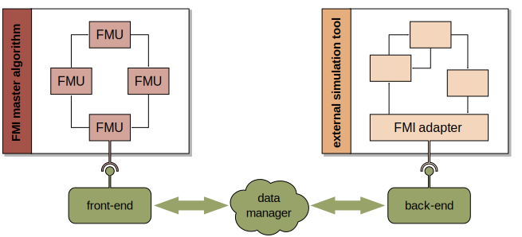
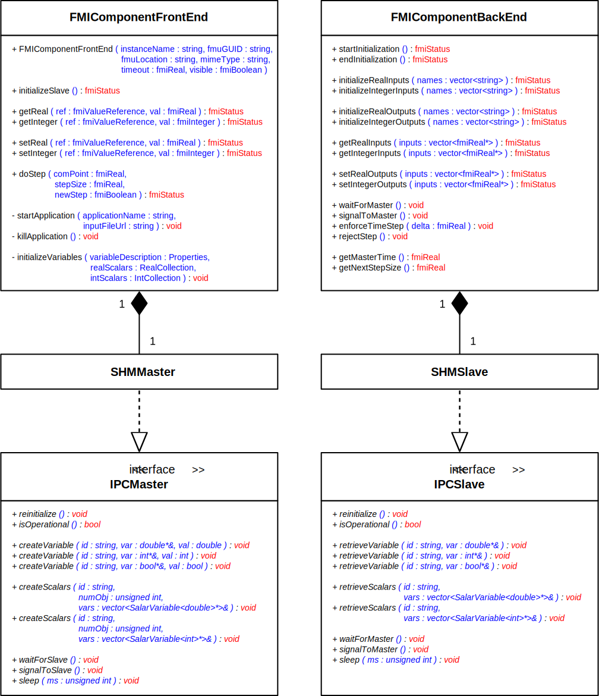

****************
Export Utilities
****************

The FMI++ library provides functionality that eases the creation of FMUs.
The goal is to facilitate the integration of existing software tools via FMI compliant interfaces and wrappers.

The ``export`` package (see :github_tree:`here <export>`) provides a toolkit that allows existing simulators to export their functionality according to the FMI specification.
This toolkit is designed such, that generic software components can be be easily adapted for a wide range of simulations tools.

Concerning **tool coupling**, simulation tools can be categorized as follows:

* **closed-source tools with API**:
  Simulation tools with a dedicated simulation API are in general the easiest case, since the API's functionality needs only to be mapped correctly to the FMI API.
  For this case, the ``export`` package provides convenience functionality to achieve this mapping.
* **closed-source tools without API**:
  Coupling tools without an API is challenging.
  However, with the front-end/back-end approach (see below) provided by the ``export`` package, tool coupling can still be achieved, as long as the simulation tool supports user-defined types with minimal control over the runtime execution.
* **open-source tools**:
  In case the source code of a simulation tool is available, both of the above ways are in principle possible.
  However, experience shows that the front-end/back-end approach (see below) is more convenient to implement, since it can be easily integrated in existing main functions.

The basic concept comprises the following components:

* a **front-end component** to be used by the simulation master
* a **back-end component** to be used by the slave application
* between these two components a proper **data management** has to be established that is responsible for the communication and data exchange between both ends

The corresponding interfaces are tailored to suit the requirements of the FMI specification.
They implement the necessary functionalities required for a master/slave concept, i.e., synchronization mechanisms and exchange of data.

FMI component front-end
=======================

The **front-end component** is the gateway for an external application to communicate and exchange data with a simulation tool.
The interface is designed such that it can be easily used as an FMI component (FMI type ``fmiComponent`` or ``fmi2Component``).
It implements methods close to the requirements of the FMI specification, e.g., functions ``initializeSlave(...)``, ``doStep(...)``, ``setReal(...)`` etc.

The front-end is responsible for:

* **information retrieval**:
  parsing of model description
* **variable initialization**:
  allocation of memory (via API or dedicated data management)
* **variable handling**:
  manage mapping between model specific variable names and FMI value references
* **application handling**:
  responsible for starting the simulation application, synchronized communication and data exchange (again, via API or dedicated data management)

FMI component back-end
======================

For simulation tools that provide no API, the **back-end component** is the counterpart to the front-end component.
It is intended to be incorporated within the slave application as part of a dedicated simulation component, referred to as the **FMI adapter**.
Its interface is designed to make the connection with the front-end as simple as possible.
The adapter has to carry out the
following tasks with the help of the back-end:

* **information retrieval**:
  the adapter has to be a part of the model that is loaded in the external simulator and retrieve/store model information at runtime (e.g., names and types of inputs and outputs)
* **establishing the data exchange**:
  the adapter has to connect to the front-end and establish synchronized data exchange (with the help of the back-end component)
* **data exchange during runtime**:
  the adapter has to know at which point of the simulation is has to send/receive data to/from the front-end

Shared memory-based tool coupling
=================================

The **data manager** is the crucial link between the front-end and back-end.
It is split in two instances implementing the purely abstract interface definitions provided by classes ``IPCMaster`` (defined in file :github_blob:`IPCMaster.h <export/include/IPCMaster.h>`) and
``IPCSlave`` (defined in file :github_blob:`IPCSlave.h <export/include/IPCSlave.h>`), which are intended to be used by the front-end and the back-end, respectively.

The data manager’s responsibilities are:

* **data handling**:
  designed for handling FMI scalar variables (XML type ``fmiScalarVariable`` or ``fmi2ScalarVariable``) and other model-related attributes (e.g., name, value reference)
* **synchronization**:
  prevent indeterministic behavior, i.e., uncoordinated data access from front-end and back-end
* **flexibility**:
  the abstract interfaces have been designed such that data transfer and synchronization can be achieved in various ways, e.g., shared memory access or via local/network sockets

Currently, the ``export`` package provides a data manager based on shared memory access to share data, including semaphores for the synchronization of both ends.

Examples
========

The examples presented below correspond to the three possible categories of tool coupling detailed above, i.e., closed-source tools with API, closed-source tools without API and open-source tools.

PowerFactory
------------

`PowerFactory <https://www.digsilent.de/en/>`_ is a proprietary closed-source tool for power system analysis.
It comes with a dedicated simulation API that allows to control and interact with an external simulation application.
The `The FMI++ PowerFactory FMU Export Utility <https://github.com/fmipp/powerfactory-fmu>`_ provides an example of how to develop an FMI-compliant wrapper by deriving from class ``FMIComponentFrontendBase``.

TRNSYS
------

`TRNSYS <https://www.trnsys.com/>`_ is a proprietary closed-source tool for simulating the behavior of transient system, with a strong focus on assessing the performance of buildings.
Even though it provides no API for extenal applications, the front-end/back-end approach can be utilized to develop an FMI-compliant wrapper.
The `The FMI++ TRNSYS FMU Export Utility <https://github.com/fmipp/trnsys-fmu>`_ provides an example of how to utilize this
generic concept by implementing a dedicated TRNSYS component (Type6139).

Stand-alone application
-----------------------

This example is part of the FMI++ libary unit tests that shows how a stand-alone C++ application can export its functionality with the help of the front-end/back-end concept.
Directory :github_tree:`test/sine_standalone_fmu <test/sine_standalone_fmu>` contains the code for a simple stand-alone main program that utilizes the functionality of the back-end to establish FMI-conformant synchronization and data exchange. :github_blob:`test/testFMIExportUtilities.cpp <test/testFMIExportUtilities.cpp>` checks the functionality of the corresponding FMU.
