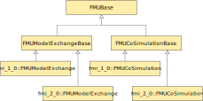
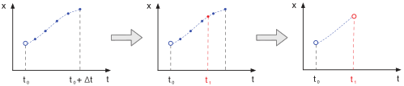

****************
Import Utilities
****************

The FMI++ library provides functionality that eases the handling of FMUs.
The goal is to facilitate the integration of FMUs into existing simulation environments.

The ``import`` package (see :github_tree:`here <import>`) provides wrappers around the C API defined by the FMI specification.
These wrappers are designed such that FMUs can be easily integrated into various popular simulation approaches, e.g., fixed time step or discrete event simulations.

The source code of package ``import`` is divided into three sub-packages, ``base``, ``integrators``, and ``utilities``, which focus on different aspects of handling FMUs.

.. note:: It is worth noting that the ``import`` package in default configuration (i.e., not using SUNDIALS, see below) has no dependencies on other libraries at run-time, since its external dependencies are solely header-only Boost packages.
  This eases the integration of the compiled library within other simulation environments.

Base functionality
==================

The subpackage ``base`` (see :github_tree:`here <import/base>`) comprises generic wrappers that ease basic manipulations of FMUs.
The functionality provided here has a certain overlap with what other FMI-related libraries offer (such as the `FMI Library <https://jmodelica.org/FMILibrary/>`_), but follows in contrast an object-oriented approach.

Class hierarchy
---------------

Class ``FMUBase`` (defined in file :github_blob:`FMUBase.h <import/base/include/FMUBase.h>`) is the base class for all other classes dealing with any type of FMU.
It defines the basic functionality needed for the convenient handling of any type of FMU, i.e., convenient getter and setter functions.
This allows for instance to set or get values by referring to their names rather than their value reference.
Specific functionalities (for ME or CS) are defined in the classes inheriting from ``FMUBase``.
Therefore, data access to any type of FMU can be handled in the same way

Model description
-----------------

The information from the XML model description files is parsed, stored and accessed with the help of class ``ModelDescription`` (defined in file :github_blob:`ModelDescription.h <import/base/include/ModelDescription.h>`).
Internally, class ``ModelDescription`` uses `Boost Property Trees <https://theboostcpplibraries.com/boost.propertytree>`_ for parsing and storing the information from the XML file.
This class provides dedicated methods for accessing basic information about an FMU, e.g. ``getGUID()``, ``getModelIdentifier()`` or ``getNumberOfContinuousStates()``.

More complex information, especially the model variables data structure, can be accessed as objects of type ``Properties`` (typedef for ``boost::PropertyTree::ptree``).
The namespace ``ModelDescriptionUtilities`` (see :github_blob:`here <import/base/include/ModelDescription.h#L149>`) provides several helper functions that ease the handling of these objects, e.g. ``getAttributes(...)``, ``hasChild(...)`` or ``hasChildAttributes(...)``.

This approach is very flexible, allowing for instance to parse an arbitrarily complex vendor annotation.
File :github_blob:`testModelDescription.cpp <test/testModelDescription.cpp>` contains code examples demonstrating the use of class ``ModelDescription``.

Model manager
-------------

At runtime, the model manager is responsible for dynamically loading an FMU's shared libraries and parsing their XML model descriptions.
This utility is implemented as a singleton (class ``ModelManager``, see file :github_blob:`ModelManager.h <import/base/include/ModelManager.h>`) and loads and parses each model only once during runtime.
The information is stored, in case other instances of the same model are instantiated later on.
This saves time in cases where simulations include many instances of the same model.

File :github_blob:`testModelManager.cpp <test/testModelManager.cpp>` contains examples demonstrating the use of class ``ModelManager``.

Class FMUModelExchange
----------------------

The most obvious obstacle for using a bare FMU for Model Exchange is its lack of an integrator.
For this reason, the FMI++ library implements the class ``FMUModelExchange``, which provides
generic methods for integration.
Class ``FMUModelExchange`` is implemented several times in different namespaces for different FMI versions.
For instance, file :github_blob:`FMUModelExchange_v2.h <import/base/include/FMUModelExchange_v2.h>` defines a version of class ``FMUModelExchange`` in namespace ``fmi_2_0``, which is intended for FMI ME V2.0.

Instances of class ``FMUModelExchange`` own the actual FMU instance.
They are able to integrate the FMU's model and advance its state up to a specified point in time, taking care of the proper handling of FMU-internal events (i.e., state events and time events).
Since class ``FMUModelExchange`` inherits from class ``FMUBase``, it also provides the functionality for convenient input and output handling.

The most important implemented features are:

* ``initialize(...)`` / ``instantiate(...)``:
  These methods are responsible for the instantiation and initialization of the FMU and all corresponding necessary internal actions.
* ``integrate(...)``:
  Advances the state of the FMU to the specified point in time.
  If specified at construction time, the integration stops before the first detected FMU-internal event.
  Otherwise it integrates over any event without further notice.
  In both cases the integration stop time is returned.
* ``raiseEvent()`` / ``handleEvents()``:
  These methods are the prerequisite for proper event handling.
  Whenever an event occurs, be it either a change of external inputs or an update of the internal state, the internal FMU instance has to be notified (via ``raiseEvent()``) and then the necessary actions have to be taken (by calling ``handleEvents()``).
* ``rewindTime(...)``:
  Event handling may in some cases involve the necessity to reset the internal FMU to a previous state.
  With this methods, the FMU-internal clock can be set back.
  This affects only the value of the internal time, but not the internal state of the FMU (which has to be changed via ``setContinuousState(...)``, etc.).

File :github_blob:`testFMUModelExchange.cpp <test/testFMUModelExchange.cpp>` contains code examples demonstrating the use of class
``FMUModelExchange``.

Class FMUCoSimulation
---------------------

Class ``FMUCoSimulation`` offers a set of convenient methods for accessing and manipulating FMUs for Co-Simulation.
Like class ``FMUModelExchange``, it is implemented several times in different namespaces for different FMI versions.
For instance, file :github_blob:`FMUCoSimulation_v2.h <import/base/include/FMUCoSimulation_v2.h>` defines a version of class ``FMUCoSimulation`` in namespace ``fmi_2_0``, which is intended for FMI CS V2.0.

Class ``FMUCoSimulation`` is mostly intended as interface for the utility classes ``FixedStepSizeFMU`` and ``InterpolatingFixedStepSizeFMU`` (see `here <#advanced-methods>`_).

Integrators
===========

For the numerical integration of FMUs for Model Exchange, the FMI++ library relies on `Boost odeint <https://github.com/boostorg/odeint>`_ and `SUNDIALS <https://computing.llnl.gov/projects/sundials>`_.
Both are highly flexible and top performing C++ libraries for numerically solving differential equations.
All code related to numerical integration can be found in sub-package ``integrators`` (see :github_tree:`here <import/integrators>`).

.. note:: Since odeint is a header-only template library, it imposes no further dependencies at runtime on FMI++.
  In contrast, when building FMI++ with SUNDIALS support, the corresponding shared libaries need to be installed additionally.

Class Integrator
----------------

This class provides the link between the numerical integration routines and the methods of class ``FMUModelExchange``.
It is implemented as a functor object, that provides the necessary inputs (i.e. the FMU's continuous states and the according derivatives) to the integration algorithm.
It also updates the internal state of the FMU with the corresponding result.

Class IntegratorStepper
-----------------------

The actual integration algorithms provided by `Boost odeint <https://github.com/boostorg/odeint>`_ and `SUNDIALS <https://computing.llnl.gov/projects/sundials>`_ are encapsulated in objects inheriting from this class.
Currently, the following integrators are supported (compare with struct ``IntegratorType`` in file :github_blob:`IntegratorType.h <import/integrators/include/IntegratorType.h>`):

+--------------------------+----------------------------------+----------+-------+----------+------------------------------------------------+
| Stepper                  | Name                             | Suite    | Order | Adaptive | Recommended usecases                           |
+==========================+==================================+==========+=======+==========+================================================+
| ``IntegratorType::eu``   | Explicit Euler                   | odeint   | 1     | No       | Testing                                        |
+--------------------------+----------------------------------+----------+-------+----------+------------------------------------------------+
| ``IntegratorType::rk``   | 4th order Runge-Kutta            | odeint   | 4     | No       | Testing                                        |
+--------------------------+----------------------------------+----------+-------+----------+------------------------------------------------+
| ``IntegratorType::abm``  | Adams-Bashforth-Moulton          | odeint   | 8     | No       | Testing                                        |
+--------------------------+----------------------------------+----------+-------+----------+------------------------------------------------+
| ``IntegratorType::ck``   | Cash-Karp                        | odeint   | 5     | Yes      | Nonstiff Models                                |
+--------------------------+----------------------------------+----------+-------+----------+------------------------------------------------+
| ``IntegratorType::dp``   | Dormand-Prince                   | odeint   | 5     | Yes      | Nonstiff Models                                |
+--------------------------+----------------------------------+----------+-------+----------+------------------------------------------------+
| ``IntegratorType::fe``   | Fehlberg                         | odeint   | 8     | Yes      | Nonstiff, smooth Models                        |
+--------------------------+----------------------------------+----------+-------+----------+------------------------------------------------+
| ``IntegratorType::bs``   | Bulirsch Stoer                   | odeint   | 1-16  | Yes      | High precision required                        |
+--------------------------+----------------------------------+----------+-------+----------+------------------------------------------------+
| ``IntegratorType::ro``   | Rosenbrock                       | odeint   | 4     | Yes      | Stiff Models                                   |
+--------------------------+----------------------------------+----------+-------+----------+------------------------------------------------+
| ``IntegratorType::bdf``  | Backward Differentiation Formula | SUNDIALS | 1-5   | Yes      | Stiff Models                                   |
+--------------------------+----------------------------------+----------+-------+----------+------------------------------------------------+
| ``IntegratorType::abm2`` | Adams-Bashforth-Moulton          | SUNDIALS | 1-12  | Yes      | Nonstiff Models with expensive right hand side |
+--------------------------+----------------------------------+----------+-------+----------+------------------------------------------------+

The integrator type can be chosen separately for each instance of type ``FMUModelExchange`` at construction time.

Advanced methods
================

The sub-package ``utility`` (see :github_tree:`here <import/utility>`) offers advanced functionality that eases the handling of FMUs.
These functionalities target the integration of FMUs into existing simulation software.

Class IncrementalFMU
--------------------

Class ``IncrementalFMU`` (defined in file :github_blob:`IncrementalFMU.h <import/utility/include/IncrementalFMU.h>`) offers the possibility to combine the basic ability to integrate the state of an FMU for ME with advanced event handling capabilities.
It implements a lookahead mechanism, where predictions of the FMU's state are incrementally computed and stored.
In case an event occurs, these predictions are used to interpolate and update the state of the FMU.
If no event occurs, the latest prediction can be directly used to update the FMU's state.

The figure shows a schematic view of an incremental update.
Shown on the left, at time *t0* the FMU's state *x* is represented by a blue circle.
According to this state, several predictions (blue dots) up to the time *t + dt* are computed and stored, with *dt* referred to as **lookahead horizon**.
In the current implementation, the time steps between these internal predictions are constant and have to be specified at instantiation time.
Next, depicted in the middle, an (external) event occurs at time *t1*.
Since the exact time of the event does in general not coincide with one of the predictions, the state at that time is interpolated using the available predictions, depicted by the red dot.
Finally, shown on the right, this interpolated prediction is used to update the actual state of the FMU, depicted by a red circle, and the old predictions are discarded.
It is important to note that the actual state of the FMU is not changed when the predictions are calculated.
This is only done during the next update.

The most important methods of class ``IncrementalFMU`` are:

* ``updateState(...)``:
  Updates the state of the FMU to the specified time, i.e., it changes the actual state using the previous state prediction(s).
  The specified time must not be further ahead than the lookahead horizon.
* ``syncState(...)``:
  Set all input corresponding to the specified time.
  Should be called directly after ``updateState(...)``.
* ``predictState(...)``:
  Compute the state predictions according to the current inputs.
* ``sync(...)``:
  This method executes ``updateState(...)``: ``syncState(...)`` and ``predictState(...)`` in one go.
* ``defineRealInputs(...)``, ``defineIntegerInputs(...)``, ...:
  Define the inputs used for synchronization via ``syncState(...)`` or ``sync(...)``.
* ``defineRealOutputs(...)``, defineIntegerOutputs(...)``, ...:
  Define the outputs to be retrieved after synchronization via ``syncState(...)`` or ``sync(...)``.
* ``getRealOutputs(...)``, ``getIntegerOutputs(...)``, ...:
  Get the outputs corresponding to the last synchronization via ``syncState(...)`` or ``sync(...)``.
* ``getCurrentState()``:
  Get the continuous state of the FMU corresponding to the last synchronization via ``syncState(...)`` or ``sync(...)``.

Method ``sync(...)`` comes in two versions, one that sets inputs to the FMU and one that does not.
In case the number of inputs for any type (``fmippReal``, ``fmippInteger``, ``fmippBoolean``, ``fmippString``) is not defined as zero but an update without inputs is necessary (e.g., due to missing inputs) there are two possible options:

* call method ``sync(fmippTime, fmippTime)`` which does not set any inputs to the FMU or
* call method ``sync(fmippTime, fmippTime, fmippReal*, fmippInteger*, fmippBoolean*, fmippString*)`` with NULL pointers for the corresponding input(s).

The functionality of the following methods can be modified in order to customize the behavior by inheriting from class ``IncrementalFMU``:

* ``checkForEvent(...)``:
  This method checks for each new prediction whether an FMU-internal event has occurred.
  In case it returns ``true``, no further prediction is computed.
  It is implemented as a virtual method, enabling the user to customize its behavior.
* ``handleEvent()``:
  This method is called in case ``checkForEvent(...)`` has returned ``true``.
  It is implemented as a virtual method, which enables the user to customize its behavior.
* ``initializeIntegration(...)``:
  This method initializes the integration by defining the first prediction.
  By default, this is the current state of the FMU.
  It is implemented as a virtual method, which enables the user to customize its behavior.

The default implementation of class ``IncrementalFMU`` recognizes FMU-internal events and stops the prediction at the corresponding time.
This implementation uses a linear interpolation technique to estimate the state from the stored predictions.
Inheriting from class ``IncrementalFMU`` makes it possible to extend this functionality by customizing ``checkForEvent(...)``, ``handleEvent()`` and ``initializeIntegration(...)``.

File :github_blob:`testIncrementalFMU.cpp <test/testIncrementalFMU.cpp>` contains code examples demonstrating the proper use of class ``IncrementalFMU``.

Class RollbackFMU
-----------------

Class ``RollbackFMU`` (defined in file :github_blob:`RollbackFMU.h <import/utility/include/RollbackFMU.h>`) implements an easy way to reset the state of an FMU for Model Exchange to a state according to a previous time step using the methods ``saveCurrentStateForRollback()`` and ``releaseRollbackState()``.

Assume that at time *t0* the method call ``integrate( t1 )`` was issued, i.e., the integration of the associated FMU from time *t0* to time *t1* > *t0*.
In case there happend no event during the integration, after the method call the internal state of the FMU corresponds to time *t1*.
Now, in order to rollback the FMU to a state corresponding to time *t2*, with *t0* < *t2* < *t1*, the method call *integrate( t2 )* is sufficient.

Internally, class ``RollbackFMU`` stores a rollback state.
No rollbacks corresponding to a time previous to that internally stored rollback state are possible.
If not otherwise instructed, the latest stored rollback state is overwritten with the current state, in case the integration endpoint is in the future.
However, the method ``saveCurrentStateForRollback()`` enforces the current state to be stored as rollback state until it is explicitly released with method ``releaseRollbackState()``.
This allows to make a rollback over more than one time-consecutive integration cycle.

File :github_blob:`testRollbackFMU.cpp <test/testRollbackFMU.cpp>` contains examples demonstrating the use of class ``RollbackFMU``.

Class FixedStepSizeFMU
----------------------

Class ``FixedStepSizeFMU`` (defined in file :github_blob:`FixedStepSizeFMU.h <import/utility/include/FixedStepSizeFMU.h>`) eases the use of FMUs for Co-Simulation that enforce a fixed time step, i.e., FMU communication intervals with a fixed length.
Its handling is very similar to class ``IncrementalFMU``, i.e., it defines the methods ``defineRealInputs(...)``, ``defineRealOutputs(...)``, ``getRealOutputs(...)``, etc. in an analogous way.
However, method ``sync(...)`` always synchronizes the internal state to the FMU state corresponding to the latest FMU communication point, i.e., it implements a zero-order hold. 
Methods ``sync(...)`` always returns the time of the next FMU communication point.
Whenever an FMU communication point is reached, the latest inputs are handed to the FMU.
This means, that multiple calls of sync between two FMU communication points with different inputs will only cause the latest input to be handed to the FMU (no queueing).

File :github_blob:`testFixedStepSizeFMU.cpp <test/testFixedStepSizeFMU.cpp>` contains code examples demonstrating the use of class ``FixedStepSizeFMU``.

Class InterpolatingFixedStepSizeFMU
-----------------------------------

Class ``InterpolatingFixedStepSizeFMU`` works analogous to class ``FixedStepSizeFMU``.
The only difference is that real-valued outputs, i.e., those outputs defined via ``defineRealOutputs(...)`` and extracted via ``getRealOutputs(...)``, are linearly interpolated between two consecutive FMU communication points.

File :github_blob:`testInterpolatingFixedStepSizeFMU.cpp <test/testInterpolatingFixedStepSizeFMU.cpp>` contains code examples demonstrating the use of class ``InterpolatingFixedStepSizeFMU``.

Cross-language wrappers
=======================

The FMI++ library provides cross-language wrappers in Java and Python for most classes of package ``import``.
Section :doc:`Building and Installing <installation>` provides detailed information about how to setup FMI++ to build these cross-language wrappers.
